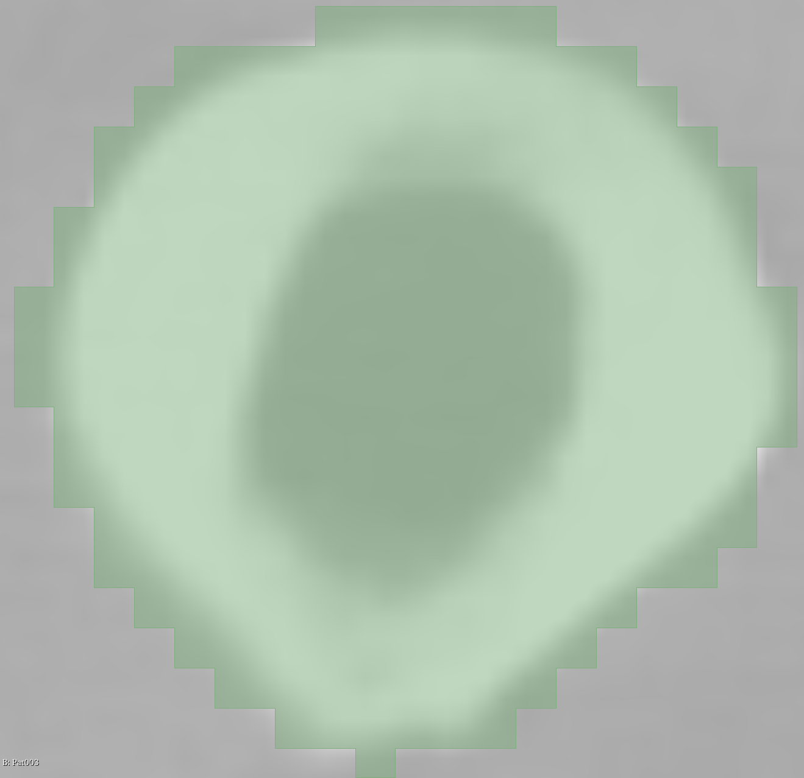
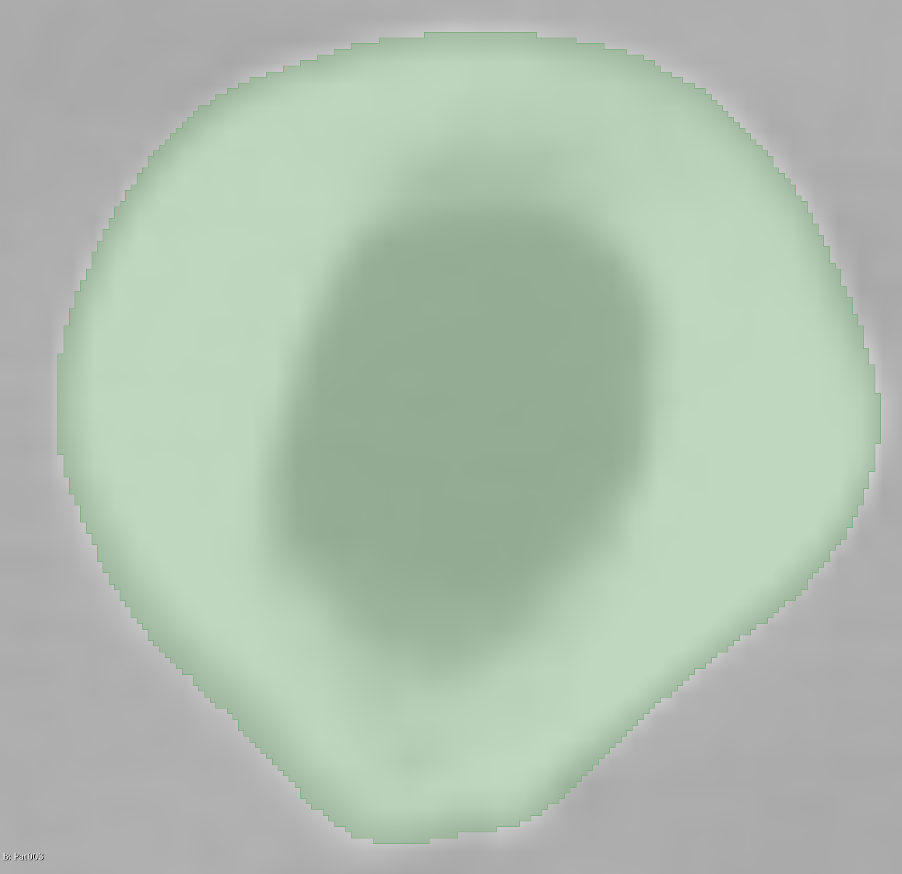

# Refining of Bone Segmentations

The goal of this project is to refine the coarse 1.5mm segmentations
from [TotalSegmentator](https://github.com/wasserth/TotalSegmentator), producing smoother boundaries while still fitting
the underlying CT image.




The best result was achieved by training a guided super-resolution model
using [nnU-Net](https://github.com/MIC-DKFZ/nnUNet). This model uses the original CT scan along with the low-resolution
segmentation to guide the upsampling process.

## Setup

### Dependencies

Using `uv`:

```sh
uv venv
uv sync
```

Activate the venv:

```sh
source .venv/bin/activate
```

### Create directory structure

```shell
mkdir data
mkdir data/raw
mkdir data/preprocessed
mkdir data/segmentations
mkdir data/nnUNet
mkdir data/nnUNet/raw
```

### Download data

Here is a small dataset to play around with: https://doi.org/10.5281/zenodo.10047263
Put this in `data/raw/`:

```sh
cd data/raw/
wget https://zenodo.org/records/10047263/files/Totalsegmentator_dataset_small_v201.zip?download=1
unzip Totalsegmentator_dataset_small_v201.zip
```

You can also use a high-res dataset like: https://amsacta.unibo.it/id/eprint/8431/

```sh
cd data/raw/
wget https://amsacta.unibo.it/id/eprint/8431/31/HFValid_Collection_v3.zip
unzip HFValid_Collection_v3.zip

cd HFValid_Collection_v3
unzip Subjects
```

### View data

You can also use [3D Slicer](https://www.slicer.org/) to view the nii files directly.

## Refining

For refinement generally the following steps are used:

- Convert files to NIfTI format
- Upsample to higher resolution
- Apply refinement filters

### Smoothing

File conversion:

```sh
python src/conversion.py data/raw/HFValid_Collection_v3/Subjects/Pat001/Pat001.stl data/preprocessed/label_high_res.nii.gz -v 0.75
python src/conversion.py data/raw/HFValid_Collection_v3/Subjects/Pat001/Pat001.stl data/preprocessed/label_low_res.nii.gz -v 1.5
```

Upsampling:

```sh
python src/resample.py data/preprocessed/label_low_res.nii.gz data/preprocessed/upsampled.nii.gz -z 2
```

Refinement using smoothing filters:

```sh
python src/smoothing.py data/preprocessed/upsampled.nii.gz data/preprocessed/smoothed.nii.gz -s 3
```

### nnUNet

First set the environment variables:

```sh
export nnUNet_raw="data/nnUNet/raw"
export nnUNet_preprocessed="data/nnUNet/preprocessed"
export nnUNet_results="data/nnUNet/results"
```

#### Inference

The following command can be used to upsample with nnUNet.  
Note that you have to set the dataset to match the model you want to use.

```sh
nnUNetv2_predict -i <input_path> -o <output_path> -d <dataset_id> -c 3d_fullres -f 0 -chk checkpoint_best.pth
```

Here is an example upsampling the TotalSegmentator output.  
Generate TotalSegmentator output:

```sh
python src/conversion.py data/raw/HFValid_Collection_v3/Subjects/Pat001/Pat001.nrrd data/segmentations/ct.nii.gz
TotalSegmentator -i data/segmentations/ct.nii.gz -o data/segmentations/ -p -rs femur_right
```

Upsampling:

```sh
python src/resample.py data/segmentations/femur_right.nii.gz data/segmentations/femur_right_resampled.nii.gz -z 4
```

Refinement using nnUNet:

```sh
python src/prepare_nnunet_predict.py data/segmentations/ct.nii.gz data/segmentations/femur_right_resampled.nii.gz data/nnUNet/validation/femur_001_0000.nii.gz data/nnUNet/validation/femur_001_0001.nii.gz
nnUNetv2_predict -i data/nnUNet/validation/ -o data/nnUNet/validation/outputs/ -d 101 -c 3d_fullres -f 0 -chk checkpoint_best.pth
```

#### Training

First generate the data:

```sh
python src/prepare_nnunet_training.py data/raw/HFValid_Collection_v3/Subjects/ data/nnUNet/raw/ data/nnUNet/validation/ --dataset-id 101 --dataset-name FemurRefine --seed 644501148679811808
```

Run preprocessing:

```sh
nnUNetv2_plan_and_preprocess -d 101 --verify_dataset_integrity
```

Run training

```sh
nnUNetv2_train 101 3d_fullres 0
```

#### Deployment

Follow the steps described [here](https://github.com/MIC-DKFZ/nnUNet/blob/master/documentation/how_to_use_nnunet.md#how-to-deploy-and-run-inference-with-your-pretrained-models).  
In short:

```sh
# Package to zip
nnUNetv2_export_model_to_zip -d <dataset_id> -c 3d_fullres -f 0 -chk checkpoint_best.pth --not_strict
# Unpack at target
nnUNetv2_install_pretrained_model_from_zip <zip file>
```

## Comparison/Evaluation

To compare segmentations you can use the SlicerRT extension for 3D Slicer.  
Using the Segment Comparison model you can compute the Dice Similarity.

In code, you can do the following.

```sh
python src/compare.py data/raw/HFValid_Collection_v3/Subjects/Pat091/Pat091.stl data/nnUNet/validation/inputs/femur_091_0001.nii.gz data/nnUNet/validation/outputs/femur_091.nii.gz data/nnUNet/validation/labels/femur_091.nii.gz
```

Note that the stl->nifti conversion uses voxel spacing 0.3mm by default. Use '-v <float>' to set different spacing.

## Scripts

Some additional scripts are available in [scripts/](scripts.md).
